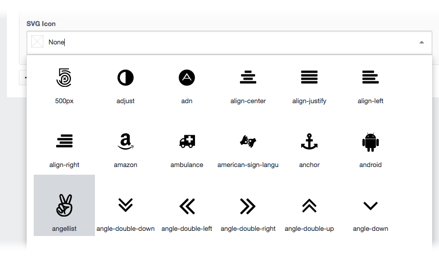

# SVG Icons plugin for Craft CMS

SVG Icons offers a custom field type allowing users to choose icons from individual files or sprite sheets within Craft CMS.

## Installation

To install SVG Icons, follow these steps:

1. Download & unzip the file and place the `svgicons` directory into your `craft/plugins` directory
2.  -OR- do a `git clone https://github.com/fyrebase/svg-icons.git svgicons` directly into your `craft/plugins` folder.  You can then update it with `git pull`
3. Install plugin in the Craft Control Panel under Settings > Plugins
4. The plugin folder should be named `svgicons` for Craft to see it.  GitHub recently started appending `-master` (the branch name) to the name of the folder for zip file downloads.

SVG Icons works on Craft 2.6.x.

## SVG Icons Overview

The SVG Icons plugin introduces a custom fieldtype allowing you to quickly and easily access any set of SVG icons stored within your sites public directory without giving your clients the ability to delete or upload.

To get started, simply create a directory called `svgicons` (This is configurable) in your `public` directory and place a subdirectory containing your SVG icons within. You can add as many icon sets as you like.

---

**To use SVG sprite sheets the sprite sheet must end with `-sprites` with either a `css` or `svg` extension.**

---

Create a field using the `SVG Icons` field type and choose which icon set you would like to use.

## Configuring SVG Icons

SVG Icons comes with its own `config.php` which you can over ride by simply creating a `svgicons.php` in your Craft `config` directory.

### iconSetsPath [string]

***Default `$_SERVER['DOCUMENT_ROOT'] . '/svgicons/'`***

File system path to the folder where you want to store your icon sets.

### iconSetsUrl [string]

***Default `'/svgicons/'`***

The `iconSetsUrl` will be prepended to the path and filename of the icon.

## Using SVG Icons

### SvgIconsModel

Public attributes and methods of the `SvgIconsModel` model.

#### Attributes

**`icon` [string]**

The icon path

**`sprite` [string]**

The icon id within the sprite sheet

**`width` [number]**

The icon original width

**`height` [number]**

The icon original height

#### Methods

#### \__toString

**`{{ svgIcon }}` [string]**

Returns icon path or icon id within sprite sheet

##### getInline

**`{{ svgIcon.inline }}` [string]**

Returns raw SVG for inlining. Only applicable when using individual SVG files and not sprite sheets.
If no SVG file found returns empty string.

Example `{{ svgIcon.inline }}`

##### getUrl

**`{{ svgIcon.url }}` [string]**

Returns icon path

Example `{{ svgIcon.url }}`

##### getSprite

**`{{ svgIcon.sprite }}` [string]**

Returns icon id within sprite sheet

Example `{{ svgIcon.sprite }}`

##### getDimensions

**`{{ svgIcon.dimensions }}` [array]**

Returns icon dimensions as array

Example `{{ svgIcon.dimensions }}`

##### setDimensions

**`{{ svgIcon.setDimensions(newHeight) }}` [array]**

Returns icon new dimensions in pixels as array maintaining aspect ratio

Example `{{ svgIcon.setDimensions(24) }}`

### Template Variables

#### Inline SVG Icon

**`{{ craft.svgIcons.inline(path) }}` [string]**

Returns raw SVG for inlining. Only applicable when using individual SVG files and not sprite sheets.
If no SVG file found returns empty string.

Example `{{ craft.svgIcons.inline('fontawesome/align-left.svg') }}`

#### Get SVG Icon Dimensions

**`{{ craft.svgIcons.getDimensions(path) }}` [array]**

Returns icon dimensions as array

Example `{{ craft.svgIcons.getDimensions('fontawesome/align-left.svg') }}`

#### Set SVG Icon Dimensions

**`{{ craft.svgIcons.setDimensions(path, newHeight) }}` [array]**

Returns icon new dimensions in pixels as array maintaining aspect ratio

Example `{{ craft.svgIcons.setDimensions('fontawesome/align-left.svg', 24) }}`

## SVG Icons Roadmap

Some things to do, and ideas for potential features:

* Ability to use SVG sprites
* Get rid of the initial none icon allowing user to search straight away

## Bugs and Suggestions

If you stumble across any bugs let me know, or better yet submit a pull request!

I'm open to feed back and suggestions as I'm sure there is plenty of room for improvement.

## SVG Icons Changelog

### 0.0.6 -- 2016.11.17

* **[Fixed]** Updated plugin version - rookie error

### 0.0.5 -- 2016.11.16

* **[Fixed]** Fixed bug when using single SVG icon files would not display icon in CP

### 0.0.4 -- 2016.10.12

* **[Fixed]** JavaScript namespacing issue
* **[Fixed]** PHP error when failing to add icon sets during field setup.

### 0.0.3 -- 2016.10.12

* **[Added]** Initial support for SVG sprite sheets. CSS and SVG based.

### 0.0.2 -- 2016.10.05

* **[Added]** Obtain icon model from string using new template variable `getModel`
* **[Added]** Renamed `getIconFromString` service method to `getModel` and fixed pathing issue
* **[Improved]** Updated README.md

### 0.0.1 -- 2016.09.13

* Initial release

Brought to you by [Fyrebase](http://fyrebase.com)
